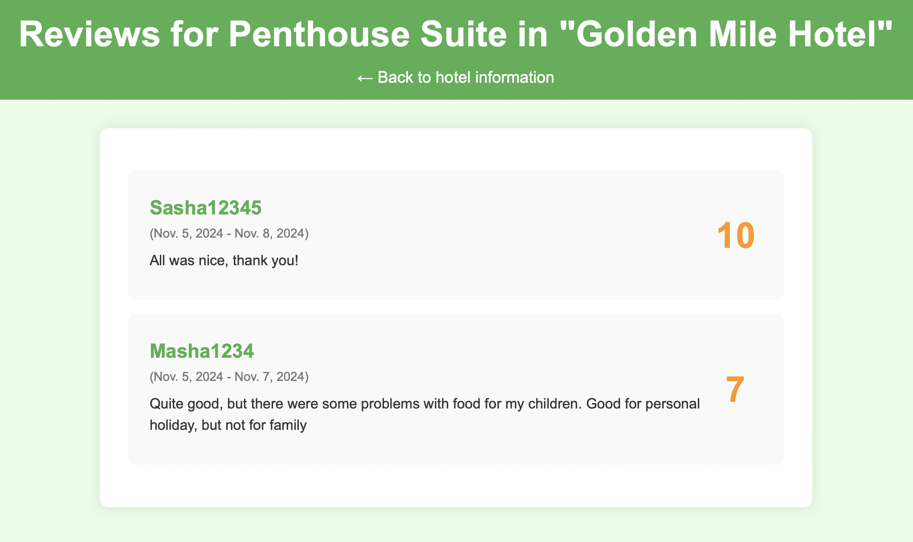

## Реализация простого сайта на django

Цель: овладеть практическими навыками и умениями реализации web-сервисов
средствами Django 2.2.

Тема: "Список отелей"

Необходимо учитывать 
* Название отеля
* Владельца отеля
* Адрес
* Описание
* Типы номеров
* Стоимость
* Вместимость
* Удобства

Необходимо реализовать следующий функционал:
* Регистрация новых пользователей.
* Просмотр и резервирование номеров. Пользователь должен иметь
возможность редактирования и удаления своих резервирований.
* Написание отзывов к номерам. При добавлении комментариев, должны
сохраняться период проживания, текст комментария, рейтинг (1-10),
информация о комментаторе.
* Администратор должен иметь возможность заселить пользователя в отель и
выселить из отеля средствами Django-admin.
* В клиентской части должна формироваться таблица, отображающая
постояльцев отеля за последний месяц.

Ход работы:

1. Создаем проект и приложение

2. Далее сразу определим и создадим модели 

```
from django.core.validators import MinValueValidator, MaxValueValidator
from django.db import models
from django.contrib.auth.models import User


class Hotel(models.Model):
    name = models.CharField(max_length=20)
    description = models.TextField()
    address = models.CharField(max_length=30)
    owner = models.CharField(max_length=30)


class RoomType(models.Model):
    type = models.CharField(max_length=20)
    description = models.TextField()
    capacity = models.CharField(max_length=100)
    facilities = models.CharField(max_length=100)


class Room(models.Model):
    hotel = models.ForeignKey(Hotel, on_delete=models.CASCADE, related_name="rooms")
    type = models.ForeignKey(RoomType, on_delete=models.CASCADE)
    price = models.CharField(max_length=100)


class Reservation(models.Model):
    user = models.ForeignKey(User, on_delete=models.CASCADE)
    hotel = models.ForeignKey(Hotel, on_delete=models.CASCADE)
    room = models.ForeignKey(Room, on_delete=models.CASCADE)
    start_date = models.DateField()
    end_date = models.DateField()
    status = models.CharField(max_length=20, choices=[('checked_in', 'Checked In'), ('checked_out', 'Checked Out')], default='not_checked_in')


class Review(models.Model):
    reservation = models.ForeignKey(Reservation, on_delete=models.CASCADE)
    rating = models.IntegerField(validators=[MinValueValidator(1), MaxValueValidator(10)])
    comment = models.TextField()
```
Примечание: модель пользвоателя создается автоматически через внутрянку Django <br>
Выполняем миграции, наши модели автоматически создаются. Предоставляем доступ к моделям в админке:

```
admin.site.register(Hotel)
admin.site.register(Room)
admin.site.register(RoomType)
admin.site.register(Review)
admin.site.register(Reservation)
```

3. Переходим к постепенному созданию полноценного проекта. Начнем с авторизации пользвоателя (регистрация + вход)
Создаем форму регистрации:
```
class UserRegistrationForm(UserCreationForm):
    email = forms.EmailField(required=True)

    class Meta:
        model = User
        fields = ('username', 'email', 'password1', 'password2')
        widgets = {
            'username': forms.TextInput(),
            'email': forms.EmailInput(),
            'password1': forms.PasswordInput(),
            'password2': forms.PasswordInput(),
        }

    def __init__(self, *args, **kwargs):
        super().__init__(*args, **kwargs)
        for field in ['username', 'email', 'password1', 'password2']:
            self.fields[field].help_text = None
```
И контроллера:
```
def user_registration(request):
    if request.method == 'POST':
        form = UserRegistrationForm(request.POST)
        if form.is_valid():
            user = form.save()
            login(request, user)
            return redirect('login')
    else:
        form = UserRegistrationForm()
    return render(request, 'registration.html', {'form': form})
```

4. Теперь поработаем с отелями. Нам нужно создать контроллеры для получения списка всех отелей и информации о конкретном, а также страницы для визуализации:
```
def get_all_hotels(request):
    hotels = Hotel.objects.all()
    return render(request, 'hotels.html', {'hotels': hotels})


def get_hotel_info(request, hotel_id):
    try:
        hotel = Hotel.objects.get(pk=hotel_id)
    except:
        raise Http404("Hotel does not exist")
    rooms = hotel.rooms.all()
    return render(request, 'hotel_info.html', {'hotel': hotel, 'rooms': rooms})
```
Итог:


5. Следующий этап - бронирование. Необходимо добавить функционал для создания / редактирвоания / удаления бронирования. Приступим!
```
@login_required
def get_all_reservations(request):
    reservations = Reservation.objects.filter(user=request.user)
    return render(request, 'all_reservations.html', {'reservations': reservations})


@login_required
def create_reservation(request, room_id):
    try:
        room = Room.objects.get(pk=room_id)
    except Room.DoesNotExist:
        raise Http404("Room does not exist")
    if request.method == 'POST':
        start_date = request.POST.get('start_date')
        end_date = request.POST.get('end_date')
        reservation = Reservation(user=request.user, hotel=room.hotel, room=room, start_date=start_date, end_date=end_date)
        reservation.save()
        return redirect('all_reservations')
    return render(request, 'create_reservation.html', {'room': room})


@login_required
def update_reservation(request, reservation_id):
    try:
        reservation = Reservation.objects.get(pk=reservation_id)
    except Reservation.DoesNotExist:
        raise Http404("Reservation does not exist")
    if request.method == 'POST':
        reservation.start_date = request.POST.get('start_date')
        reservation.end_date = request.POST.get('end_date')
        reservation.save()
        return redirect('all_reservations')
    return render(request, 'update_reservation.html', {'reservation': reservation})


@login_required
def delete_reservation(request, reservation_id):
    try:
        reservation = Reservation.objects.get(pk=reservation_id)
    except Reservation.DoesNotExist:
        raise Http404("Reservation does not exist")
    if request.method == 'POST':
        reservation.delete()
        return redirect('all_reservations')
    return render(request, 'delete_reservation.html', {'reservation': reservation})
```
В результате получилось следующее:


6. Следующий этап - отзывы. Аналогично можно просматривать все отзывы, добавлять свой
```
@login_required
def create_review(request, reservation_id):
    try:
        reservation = Reservation.objects.get(pk=reservation_id, user=request.user)
    except Reservation.DoesNotExist:
        raise Http404("Reservation does not exist")
    if request.method == 'POST':
        form = ReviewForm(request.POST)
        if form.is_valid():
            review = form.save(commit=False)
            review.reservation = reservation
            review.user = request.user
            review.save()
            return redirect('all_reservations')
    else:
        form = ReviewForm()
    return render(request, 'create_review.html', {'form': form, 'reservation': reservation})


@login_required
def get_all_reviews(request, room_id):
    try:
        room = Room.objects.get(pk=room_id)
    except Room.DoesNotExist:
        raise Http404("Room does not exist")
    reviews = Review.objects.filter(reservation__room=room)
    return render(request, 'all_reviews.html', {'room': room, 'reviews': reviews})
```
Итог: 




7. Настало время перейти к админке. Тут сначала реализуем возможность заселить пользователя в отель и
выселить из отеля средствами Django-admin. Для этого создадим дополнительные actions для модели Reservation
```
class ReservationAdmin(admin.ModelAdmin):
    list_display = ('user', 'hotel', 'start_date', 'end_date', 'status')
    actions = ['check_in', 'check_out']
    list_filter = (LastMonthFilter,)

    def check_in(self, request, queryset):
        queryset.update(status='checked_in')

    def check_out(self, request, queryset):
        queryset.update(status='checked_out')
```
Теперь в админке мы можем выбирать любыем бронирования и менять их статус. Изначально он приравнен к отсутствующему. Далее можно подтверждать и, наоборот, снимать брони с каждого пользвоателя

8. И финальная часть - фильтрация. Именно так мне захотелось реализовать последний блок, а именно с просмотром брониорваний за последний месяц. Для этого создадим в админке дополнительный фильтр и при необходимости будем его применять
```
class LastMonthFilter(admin.SimpleListFilter):
    title = 'Data'
    parameter_name = 'last_month_reservations'

    def lookups(self, request, model_admin):
        return [('last_month_reservations', 'Last month reservations')]

    def queryset(self, request, queryset):
        if self.value() == 'last_month':
            return queryset.filter(start_date__gte=timezone.now() - timezone.timedelta(days=30))
        return queryset
```