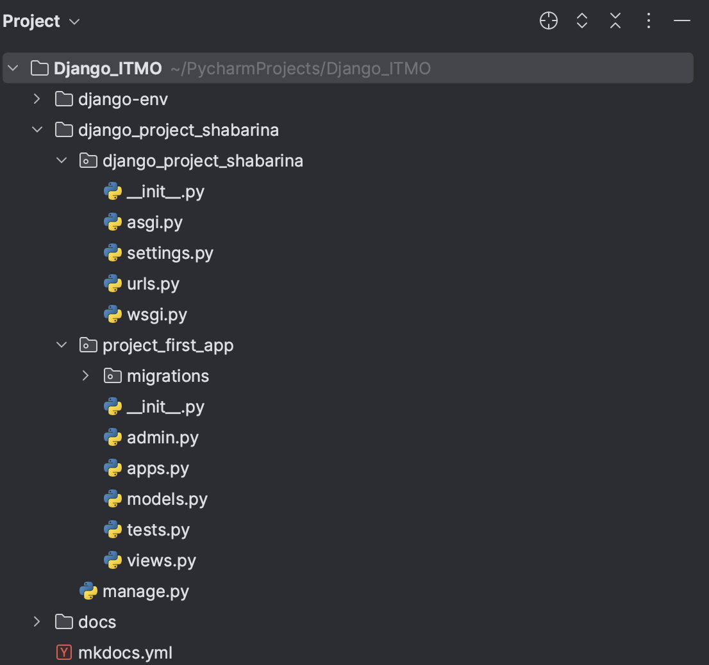
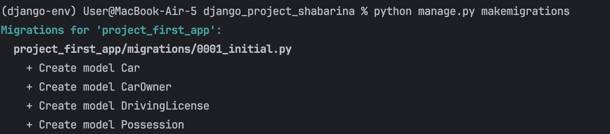
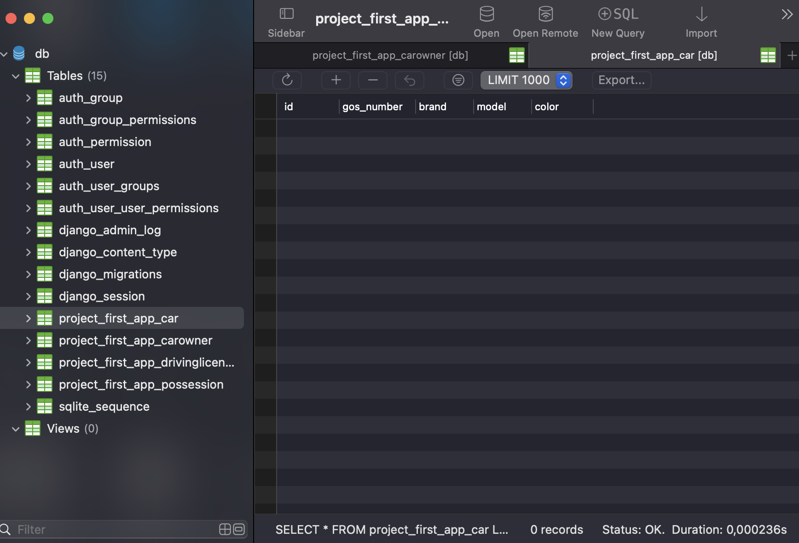
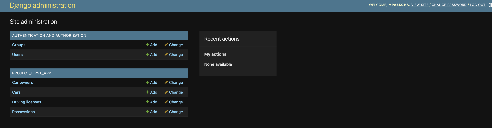
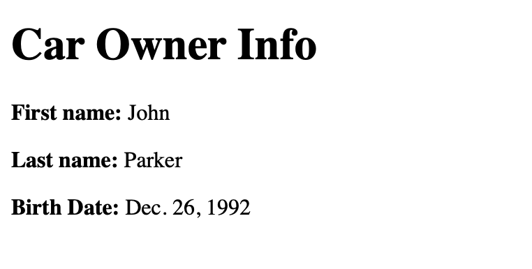

## Практическая работа №2.1. "Django Web framework. Установка. Реализация первого приложения"
Цель работы: дать краткое представление о работе Django WEB фреймворка.

### Задача №1. Установка Django Web framework.

После создания проекта и приложения получилась следующая структура:


### Задача №2. Описание файловой архитектуры созданного проекта.

Рассмотрим модели, которые необходимо было создать:
1. Автовладелец (фаимилия, имя, дата рождения). Связан с "Владение" и "Водительское удостоверение" по внешнему ключу 
2. Владение (id владельца, id ватомобиля, дата начала, дата конца). Связан с "Автовладелец" и "Автомобиль" по внешним ключам
3. Автомобиль (гос номер, марка, модель, цвет). Связан с "Владение" по внешнему ключу
4. Водительское удостоверение (id владельца, номер, тип6 дата выдачи) 

### Листинг кода:

```
from django.db import models


class CarOwner(models.Model):
    first_name = models.CharField(max_length=30)
    last_name = models.CharField(max_length=30)
    date_of_birth = models.DateField(null=True)


class Car(models.Model):
    gos_number = models.CharField(max_length=15)
    brand = models.CharField(max_length=20)
    model = models.CharField(max_length=20)
    color = models.CharField(max_length=30, null=True)


class Possession(models.Model):
    owner_id = models.ForeignKey(CarOwner, on_delete=models.CASCADE, null=True)
    car_id = models.ForeignKey(Car, on_delete=models.CASCADE, null=True)
    date_start = models.DateTimeField()
    date_end = models.DateTimeField(null=True)


class DrivingLicense(models.Model):
    owner_id = models.ForeignKey(CarOwner, on_delete=models.CASCADE)
    license_number = models.CharField(max_length=10)
    type = models.CharField(max_length=10)
    date_issue = models.DateTimeField()
```

Теперь реализуем миграции и применить их к базе данных.


Откроем DBbrowser и проверим корректность созданной БД:

Как можно заметить, миграции прошли успешно, были созданы 4 модели в соответствии с заданными параметрами. Также можно заметить большое число других таблиц, которые были созданы автоматически средствами Django

### Задание №3. Создание админ-панели

Зарегестрируем модели данных в админ-панели

```
from django.contrib import admin
from .models import CarOwner, Car, Possession, DrivingLicense

admin.site.register(CarOwner)
admin.site.register(Car)
admin.site.register(Possession)
admin.site.register(DrivingLicense)
```

Теперь зайдем в админ-панель. Все прошло успешно. Необходимо будет добавить двух владельцев автомобилей, 4 автомобиля. Далее связать каждого владельца минимум с тремя автомобилями, так, чтобы не было пересечений по датам владения и продажи.



### Задание №4. Создание контроллеров для обработки данных
Создадим контроллер, который выводит из базы данных данные о владельце автомобиля. 

```
def car_owner(request, owner_id):
    try:
        owner = CarOwner.objects.get(pk=owner_id)
    except CarOwner.DoesNotExist:
        raise Http404("Car owner does not exist")
    return render(request, 'car_owner.html', {'owner': owner})
```

Реализуем страницу html-шаблона, которая должна содержать  отображение полей переданных из контроллера.
```
<body>
    <h1>Car Owner Info</h1>
    <p><strong>First name:</strong> {{ owner.first_name }}</p>
    <p><strong>Last name:</strong> {{ owner.last_name }}</p>
    <p><strong>Birth Date:</strong> {{ owner.date_of_birth }}</p>
</body>
```

### Задание №5. Работа с адресацией
Импортируем файл urls.py приложения в проект
```
from django.contrib import admin
from django.urls import path, include

urlpatterns = [
    path('admin/', admin.site.urls),
    path('', include('project_first_app.urls')),
]
```

Модификация urls.py приложения для вызова контролера
```
urlpatterns = [
     path('owner/<int:owner_id>/', views.get_owner, name='get_owner'),
]
```

Проверяем работоспособность программы переходом по ссылке 
“127.0.0.1:8000/owner/1”
