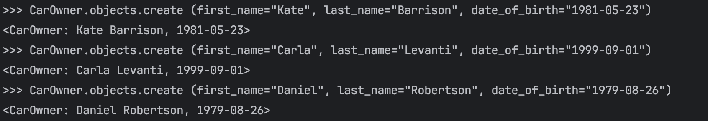
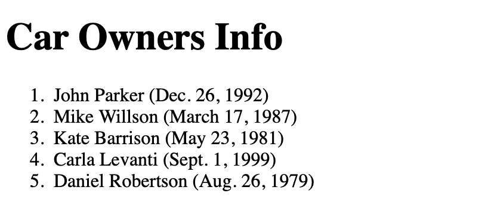
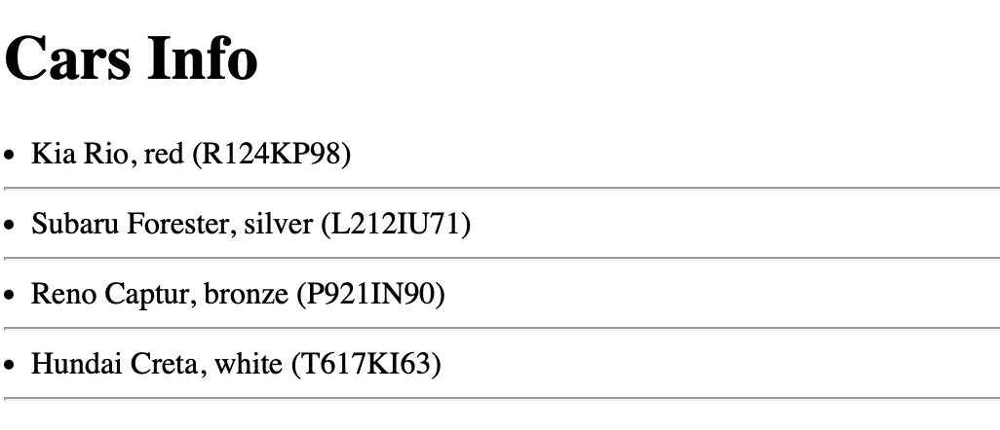
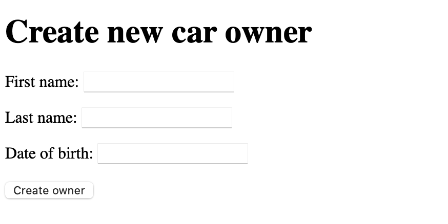

## Практическая работа №2.2. "Реализации CRUD"
Цель работы: дать подробное представление о реализации CRUD(Create, read, update and delete) интерфейсов средствами Django WEB фреймворка.

### Задание №1. Доработка модели данных. Реализация связи “Многие ко многим”
Необходимо правильно настроить связь между автомобилем, владением и владельцем.

```
class CarOwner(models.Model):
    first_name = models.CharField(max_length=30)
    last_name = models.CharField(max_length=30)
    date_of_birth = models.DateField(null=True)
    cars = models.ManyToManyField(Car, through="Possession")

    def __str__(self):
        return f"{self.first_name} {self.last_name}, {self.date_of_birth}"
```

### Задание №2. Работа с представлениями
Создадим представление для вывода всех владельцев
```
def get_all_owners(request):
    try:
        all_owners = CarOwner.objects.all()
    except CarOwner.DoesNotExist:
        raise Http404("Empty table")
    return render(request, 'all_owners.html', {'all_owners': all_owners})
После создания проекта и приложения получилась следующая структура:
```
Затем создадим отдальный html-шаблон для корректного вывода на странице всех данных
Добавим маршрут в urls.py
```
urlpatterns = [
     path('owner/<int:owner_id>/', views.get_owner, name='get_owner'),
     path('owners/', views.get_all_owners, name='get_all_owners'),
]
```

Через консоль добавим данные о владельцах в нашу модель:


И проверим работоспособность написанной программы путем вывода всей информации на отдельной html странице:


Реализовать вывод всех автомобилей, вывод автомобиля по id, обновления на основе классов. Добавить данные минимум о трех автомобилях. Должны быть реализованы контроллер (views) и шаблоны (temlates).



### Задание №3.  Работа с формами и представлениями

Создадим форму для создания владельца
```
from django import forms
from .models import CarOwner

class CreateCarOwnerForm(forms.ModelForm):
    class Meta:
        model = CarOwner
        fields = ["first_name", "last_name", "date_of_birth"]
```

Затем создадим создадиф функцию для обработки формы
```
def create_owner_form(request):
    context = {}
    form = CreateCarOwnerForm(request.POST or None)
    if form.is_valid():
        form.save()
        return redirect('get_all_owners')
    context['form'] = form
    return render(request, "create_owner.html", context)
```

