## Практическая работа №3.1. "Django Web framework. Запросы и их выполнение"
Цель работы: получить представление о работе с запросами в Django ORM.

### Задание №1. Создание объектов 
Будем использовать командную строку для взаимодействия с проектом. Откроем интерпретатор и приступим к реализации поставленных задач.

Необходимо написать запрос на создание 6-7 новых автовладельцев и 5-6 автомобилей, каждому автовладельцу назначить удостоверение и от 1 до 3 автомобилей.

Ниже приведу скриншоты с запросами в командной строке и результатами заполнения таблиц при просмотре через админскую панель:

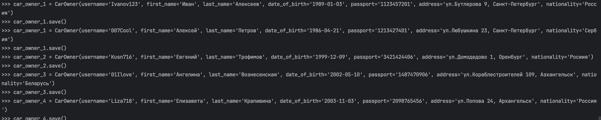

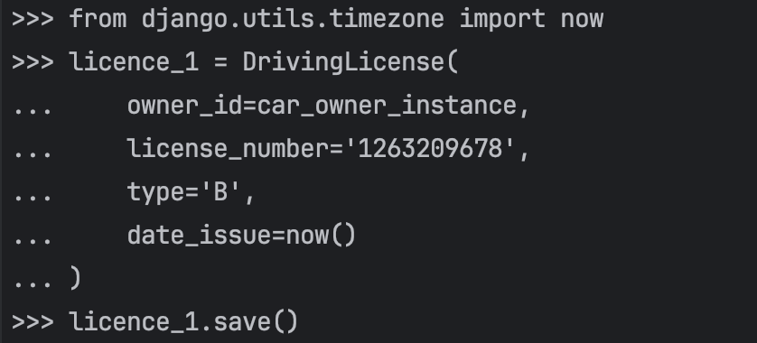

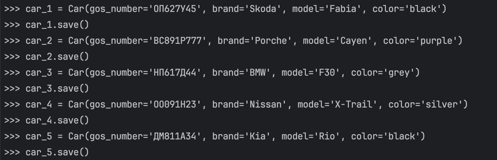

В результате получилось заполнить данными в необходимом количестве все таблицы:
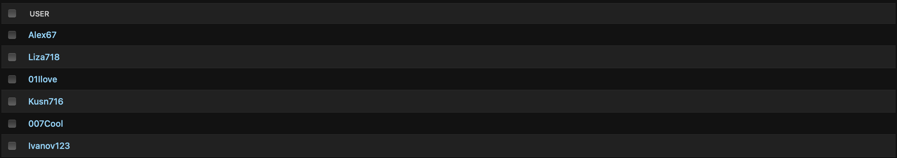

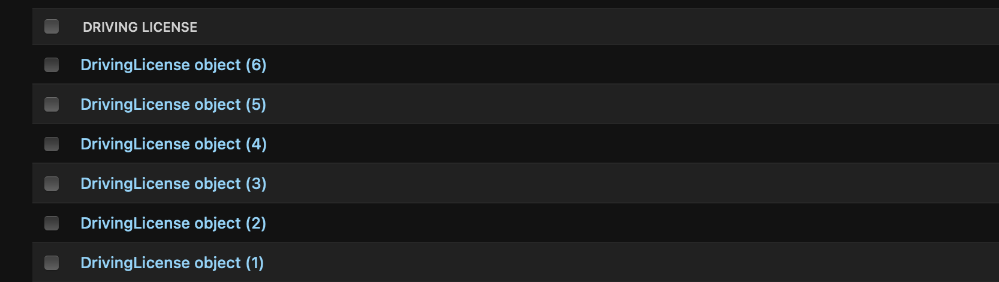

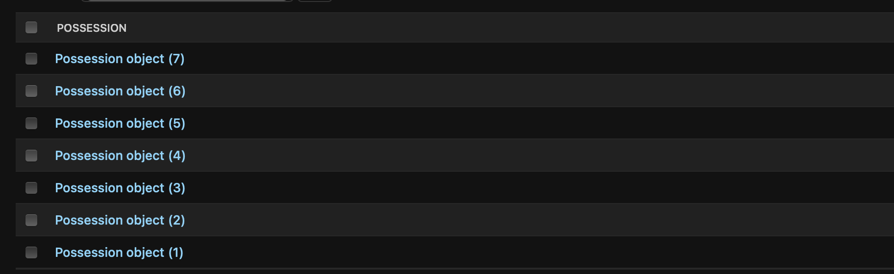

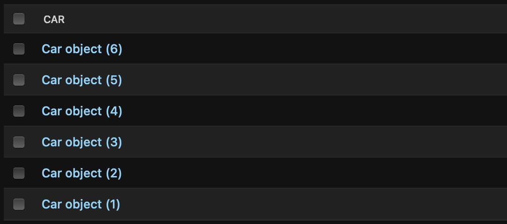

### Задание №2. Создание простых запросов
По созданным данным написать следующие запросы на фильтрацию:
- Где это необходимо, добавить related_name к полям модели
```
class Possession(models.Model):
    owner_id = models.ForeignKey(CarOwner, on_delete=models.CASCADE, null=True, related_name='possessions')
    car_id = models.ForeignKey(Car, on_delete=models.CASCADE, null=True, related_name='car_possessions')
    date_start = models.DateTimeField()
    date_end = models.DateTimeField(null=True)
```
- Вывести все машины конкрентной марки. В моем случае это будет Subaru
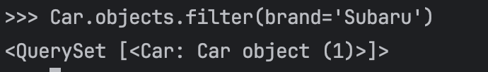
- Найти всех водителей с конкрентными именем (Ангелина)
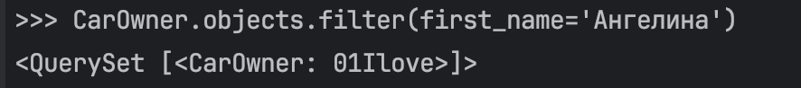
- Взяв любого случайного владельца, получить его id, и по этому id получить экземпляр удостоверения в виде объекта модели
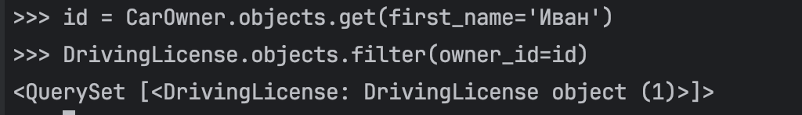
- Вывести всех владельцев красных машин
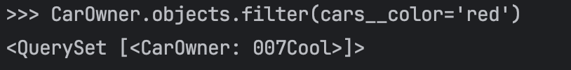
- Найти всех владельцев, чей год владения машиной начинается с 2018
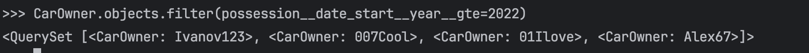

### Задание №3. Агрегация и аннотация запросов
Необходимо реализовать следующие запросы c применением описанных методов:
- Вывести дату выдачи самого старшего водительского удостоверения
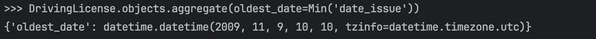
- Указать самую позднюю дату владения машиной, имеющую какую-то из существующих моделей в базе
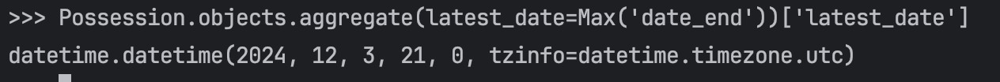
- Вывести количество машин для каждого водителя
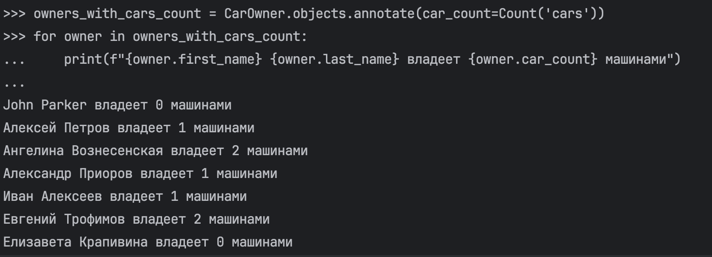
- Подсчитать количество машин каждой марки
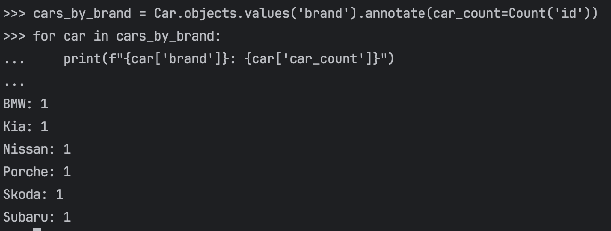
- Отсортировать всех автовладельцев по дате выдачи удостоверения
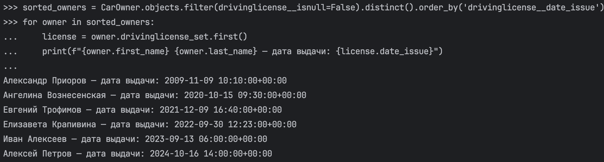

### Пояснение:
В рамках данной работы мне удалось познакомиться и реализовать создание объектов, простых запросов, а также агрегацию и аннотацию. 