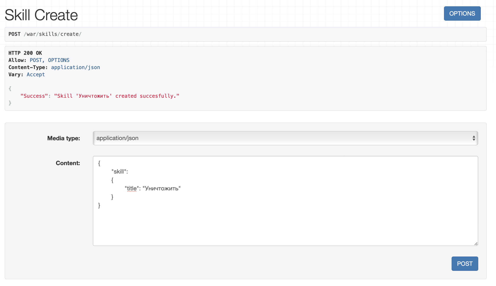
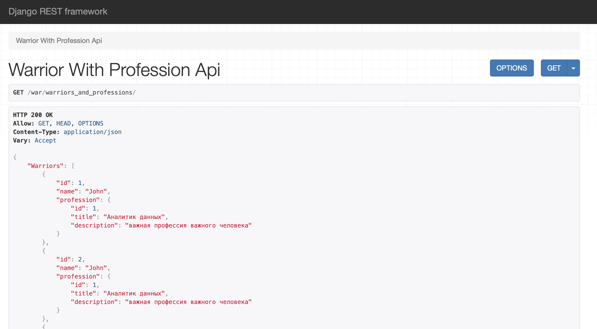

## Практическая работа №3.2. "Django rest framework"
Цель работы: получить представление об использовании возмжностей работы контроллеров и серриализаторов в Django Rest Framework.

Первым делом выполним поэтапно все необходимые пункты, которые прописаны на старте практической работы №3.2. В результате у нас будут реализованы GET и POST для Warrior и Profession:


Следующий этап - самостоятельно реализовать ендпоинты для добавления и просмотра скилов методом, описанным в первой части лабораторной работы.

Создадим сериалазеры:
```
class SkillSerializer(serializers.ModelSerializer):
    class Meta:
        model = Profession
        fields = "__all__"


class SkillCreateSerializer(serializers.ModelSerializer):
    class Meta:
        model = Profession
        fields = "__all__"
```
И импортируем их в view.py:
```
class SkillAPIView(APIView):
    def get(self, request):
        skill = Skill.objects.all()
        serializer = SkillSerializer(skill, many=True)
        return Response({"Skills": serializer.data})


class SkillCreateView(APIView):
    def post(self, request):
        skill = request.data.get("skill")
        serializer = SkillCreateSerializer(data=skill)
        if serializer.is_valid(raise_exception=True):
            profession_saved = serializer.save()
        return Response({"Success": "Skill '{}' created succesfully.".format(profession_saved.title)})
```

Проверим работоспособность, перейдя по соответствующим ссылкам:

И посмотрим, успешно ли добавление через GET запрос:


Следующее задание - реализовать ендпоинты:
- Вывод полной информации о всех войнах и их профессиях (в одном запросе)
```
class WarriorWithProfessionAPIView(APIView):
    def get(self, request):
        warriors = Warrior.objects.select_related('profession').all()
        serializer = WarriorWithProfessionSerializer(warriors, many=True)
        return Response({"Warriors": serializer.data})

        
class WarriorWithProfessionSerializer(serializers.ModelSerializer):
    profession = ProfessionCreateSerializer()

    class Meta:
        model = Warrior
        fields = ['id', 'name', 'profession']
 
        
path('warriors_and_professions/', WarriorWithProfessionAPIView.as_view()),
```


- Вывод полной информации о всех войнах и их скилах (в одном запросе)
```
class WarriorWithSkillAPIView(APIView):
    def get(self, request):
        warriors = Warrior.objects.prefetch_related('skill').all()
        serializer = WarriorWithSkillSerializer(warriors, many=True)
        return Response({"Warriors": serializer.data})

        
class WarriorWithSkillSerializer(serializers.ModelSerializer):
    skill = SkillSerializer(many=True)

    class Meta:
        model = Warrior
        fields = ['id', 'name', 'skill']
 
        
path('warriors_and_skills/', WarriorWithSkillAPIView.as_view()),
```


- Вывод полной информации о войне (по id), его профессиях и скилах
```
class WarriorDetailAPIView(APIView):
    def get(self, request, pk):
        warrior = Warrior.objects.prefetch_related('skill').select_related('profession').get(id=pk)
        serializer = WarriorSerializer(warrior)
        return Response({"Warrior": serializer.data})

        
class WarriorSerializer(serializers.ModelSerializer):
    profession = ProfessionCreateSerializer()
    skill = SkillSerializer(many=True)

    class Meta:
        model = Warrior
        fields = "__all__"
 
        
path('warrior/<int:pk>/', WarriorDetailAPIView.as_view()),
```


- Удаление война по id.
```
class WarriorDeleteView(DestroyAPIView):
    queryset = Warrior.objects.all()
    serializer_class = WarriorSerializer
 
        
path('warrior/delete/<int:pk>/', WarriorDeleteView.as_view()),
```


После удаления проверяем путем вывода всей информации о войнах. Как видим, второго id больше нет

- Редактирование информации о войне.
```
class WarriorUpdateView(UpdateAPIView):
    queryset = Warrior.objects.all()
    serializer_class = WarriorSerializer

    def get(self, request, *args, **kwargs):
        warrior = self.get_object()
        serializer = self.get_serializer(warrior)
        return Response(serializer.data)
 
        
path('warrior/update/<int:pk>/', WarriorUpdateView.as_view()),
```


И проверяем результат
